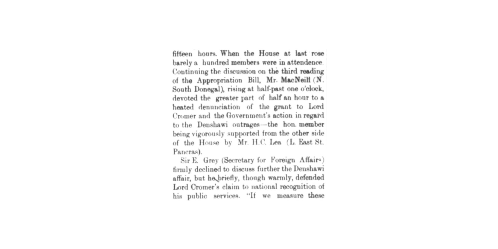

In the small village of Dinshawai, Egypt, 1906, villagers attacked a group of
English officers who were pidgeon hunting on private land, leading to the
wounding and eventual death of one officer (http://laits.utexas.edu/modern_me/egypt/2/dinshaway).
Consequently, any person involved in the attack was sentenced to death by
hanging (https://www.britannica.com/event/Dinshaway-Incident). This was a major
controversy at the time and is considered a critical turning point in Egyptian
history. After the incident, many Egyptians thought of the British as a force
that needed to be removed (http://revolutionegypt.blogs.wm.edu/2014/12/10/the-denshawai-incident/).
Even the European press condemned the British response, and the incident
eventually led to Lord Cromer's resignation in 1907 (http://laits.utexas.edu/modern_me/egypt/2/dinshaway).

